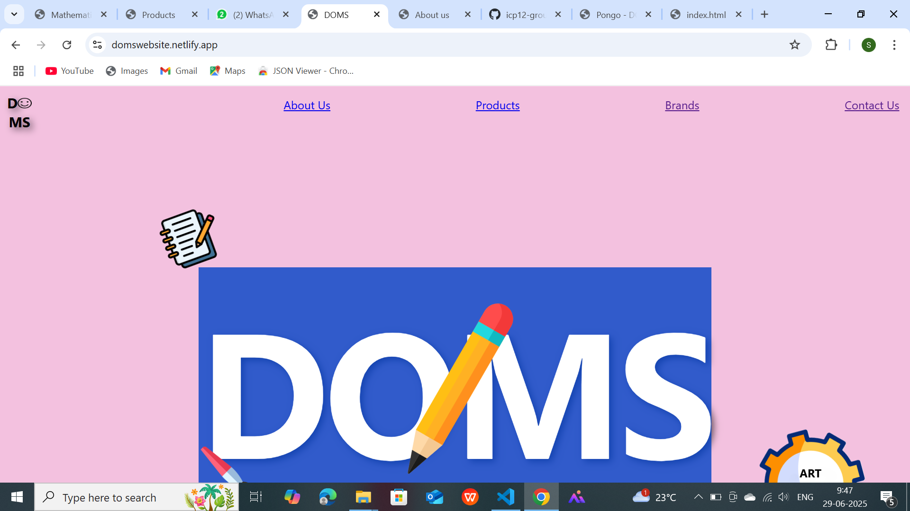
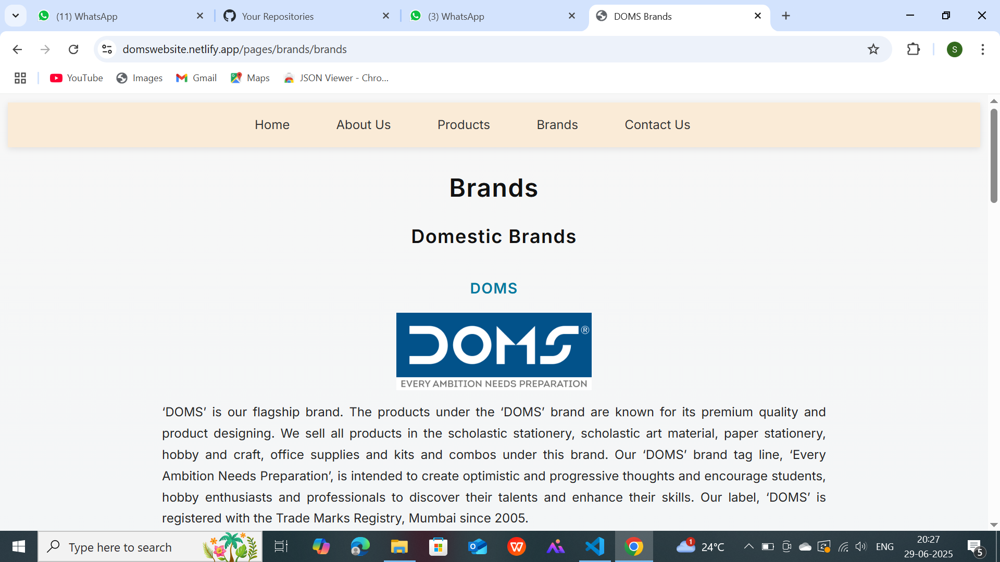
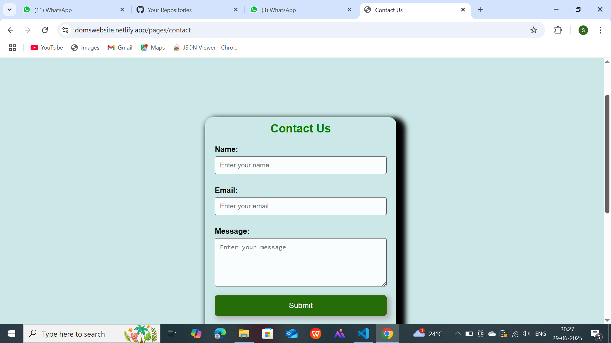

# 🏠 Home Page

The *Home Page* serves as the entry point of the DOMS website. It features the brand's logo, a welcoming design, and navigation links to major sections.

### 📄 Live website:

(https://domswebsite.netlify.app/)

### 🖼️ Preview:

### 🔗 Navigation Includes:
- About Us
- Products
- Brands
- Contact Us

### 🧩 Highlights:
- Vibrant background with fun design elements (e.g. pencil, gear icons).
- Central DOMS logo image.
- Smooth navigation experience using top links.

### 💡 Features:
- Easy access to all sections from the home screen.
- Colorful, kid-friendly look & feel.
- Designed with beginner-friendly HTML and CSS.# ## 🛒 Products Page
This is the *Products* section of our DOMS-themed website. It showcases different product categories offered by the brand.

### 🖼️ Preview:

### 🔍 Categories Displayed:
- ✏️ *Pencils & Accessories*
- 🎨 *Drawing & Colouring*
- 🖌️ *Crafts & Hobbyist*

## 📖 About Us Page

The *About Us* page introduces the legacy and vision of the founders of DOMS. It honors the pioneers who laid the foundation for the brand's excellence.

### 🖼️ Preview:

### 🙏 Highlights:
- Inspirational message:  
  “Those loved can never be more than a thought away…”
- Tribute to:  
  - *Late Shri Rasikbhai Raveshia*  
  - *Late Shri Mansukhlal Rajani*
- Section: *Infrastructure of DOMS*

### 🙏 Highlights:
- Inspirational message:  
  “Those loved can never be more than a thought away…”
- Tribute to:  
  - *Late Shri Rasikbhai Raveshia*  
  - *Late Shri Mansukhlal Rajani*
- Section: *Infrastructure of DOMS*
The *Brands* page highlights DOMS as the flagship brand and provides a detailed overview of its quality, values, and offerings.

## 🏷️ Brands Page

### 📌 Highlights:
- Section Title: *Domestic Brands*
- Brand Focus: *DOMS*
- Tagline: "Every Ambition Needs Preparation"
- Description of the brand's:
  
# 📞 Contact Us Page

The *Contact Us* page allows users to get in touch with the DOMS team by filling out a simple form.

### 🖼️ Preview:

### ✍️ Form Fields:
- *Name*: Input box for the user's name.
- *Email*: Input box for user's email address.
- *Message*: A textarea for user's message.

### 🔘 Submit Button:
- Green “Submit” button to send the message (non-functional/static in HTML/CSS only version).

## 👩‍💻 Team Members

We are a group of passionate developers collaborating on innovative web and software projects. Each of us brings unique skills in HTML, CSS, Java, and Python. Explore our GitHub profiles and repositories to see our work!

  
  
  
  
  

